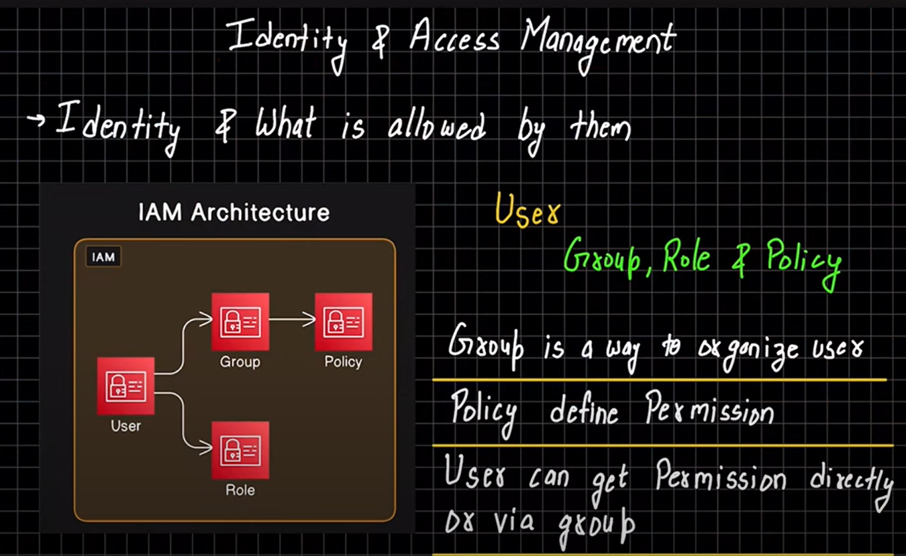

download the azure cli installer
 and install

` az login`

it will popup the window which account you need to login

maild 
password

# 1. List Available Subscriptions
To check the subscriptions associated with your account, run:
`az account list --output table`

This command will list all available subscriptions for your account in a table format. Note the subscription names or IDs that you want to select.

# Step 2: Set the Subscription (if needed)
If you have multiple Azure subscriptions, ensure you're using the correct one. To list available subscriptions:
C:\Program Files\Microsoft SDKs\Azure\.NET SDK\v2.9>az account set --subscription "Free Trial"
`az account list --output table`

# 3. List Available Tenants (If Required)
If you're working with multiple tenants, you may want to list the tenants available to you. To do that, use:

`az account tenant list --output table`
# 4. Set the Tenant (If Required)
If the issue is with selecting a tenant, you can set the tenant as follows:

`az account set --tenant "Tenant ID or Domain"`
Make sure you have the correct Tenant ID or domain name, which you can get from the az account tenant list output.

# 5. Using a Free Trial Subscription
If you're using a free trial and it's showing up as an invalid selection, verify that:

Your Free Trial is active and properly associated with your account.

The Azure CLI is authenticated with the right account by running:

`az login`
After logging in, re-check your subscriptions using az account list.

# Step 4: Create a Resource Group
A resource group is a container for managing related Azure resources. To create a resource group, run the following command:

`az group create --name <resource-group-name> --location <location>`
For example, if you want to create a resource group named myResourceGroup in the East US region:

`az group create --name myResourceGroup --location eastus`
# Step 5: Create a Virtual Network and Subnet (optional but recommended)
Creating a virtual network (VNet) and subnet ensures that your VM is in a networked environment. Here's how to create a VNet and a subnet:

`az network vnet create \
  --resource-group <resource-group-name> \
  --name <vnet-name> \
  --address-prefix <address-range> \
  --subnet-name <subnet-name> \
  --subnet-prefix <subnet-address-range>`
For example:

`az network vnet create \
  --resource-group myResourceGroup \
  --name myVNet \
  --address-prefix 10.0.0.0/16 \
  --subnet-name mySubnet \
  --subnet-prefix 10.0.1.0/24`
# Step 6: Create a Public IP Address (optional)
If you want your VM to have a public IP, create one using:

`az network public-ip create \
  --resource-group <resource-group-name> \
  --name <public-ip-name>`
For example:

`az network public-ip create \
  --resource-group myResourceGroup \
  --name myPublicIP`
# Step 7: Create a Network Interface (NIC)
Create a network interface (NIC) for the VM to connect to the VNet:

`az network nic create \
  --resource-group <resource-group-name> \
  --name <nic-name> \
  --vnet-name <vnet-name> \
  --subnet <subnet-name> \
  --public-ip-address <public-ip-name>`
    # Omit if you don’t need a public IP
For example:

`az network nic create \
  --resource-group myResourceGroup \
  --name myVMNIC \
  --vnet-name myVNet \
  --subnet mySubnet \
  --public-ip-address myPublicIP`
# Step 8: Create a Virtual Machine
Now, create the virtual machine. You’ll need to specify the OS image, the VM size, and the network interface you just created.

`az vm create \
  --resource-group <resource-group-name> \
  --name <vm-name> \
  --nics <nic-name> \
  --image <image-name> \
  --admin-username <admin-username> \
  --admin-password <admin-password> \
  --size <vm-size> \
  --public-ip-address "" `
  
   # Omit if you want to disable public IP
For example, creating a basic Ubuntu VM:

bash
Copy code
az vm create \
  --resource-group myResourceGroup \
  --name myVM \
  --nics myVMNIC \
  --image UbuntuLTS \
  --admin-username azureuser \
  --admin-password MyPassword123 \
  --size Standard_DS1_v2
Step 9: Open Ports (Optional)
If you want to open ports to access your VM (for example, SSH on port 22 for Linux or RDP on port 3389 for Windows), use the following command:

For SSH (Linux):

bash
Copy code
az vm open-port --resource-group <resource-group-name> --name <vm-name> --port 22
For RDP (Windows):

bash
Copy code
az vm open-port --resource-group <resource-group-name> --name <vm-name> --port 3389
Step 10: Verify the VM Creation
Once the VM creation is complete, you should see a summary with details of the VM. You can check the VM’s status with:

bash
Copy code
az vm show --resource-group <resource-group-name> --name <vm-name>
Step 11: Connect to the VM
Linux VM (SSH): If you created a Linux VM and opened port 22, use SSH to connect:

bash
Copy code
ssh azureuser@<public-ip>
Windows VM (RDP): If you created a Windows VM and opened port 3389, connect using Remote Desktop Protocol (RDP) and the VM’s public IP.

Summary of Commands
Here’s a summary of the main commands you'll use:

`az login`

`az group create --name myResourceGroup --location eastus`

`az network vnet create --resource-group myResourceGroup --name myVNet --address-prefix 10.0.0.0/16 --subnet-name mySubnet --subnet-prefix 10.0.1.0/24`

`az network public-ip create --resource-group myResourceGroup --name myPublicIP`

`az network nic create --resource-group myResourceGroup --name myVMNIC --vnet-name myVNet --subnet mySubnet --public-ip-address myPublicIP`

`az vm create --resource-group myResourceGroup --name myVM --nics myVMNIC --image Win2022Datacenter --admin-username azureuser --admin-password MyPassword123 --size Standard_DS1_v2`

Steps to Connect to a Windows VM Using RDP:
Ensure the VM is Running:
First, make sure that the VM is up and running. You can check this using the following command:

`az vm show --resource-group myResourceGroup --name myVM --output json`
If it’s not running, you can start it with:

`az vm start --resource-group myResourceGroup --name myVM`
Open Ports for RDP:
By default, RDP uses port 3389. You need to make sure that the network security group (NSG) associated with the VM allows inbound traffic on port 3389. You can add an RDP rule to the NSG if it's not already configured.

To allow RDP access, you can run:

`az vm nic list --resource-group myResourceGroup --vm-name myVM --query "[].networkSecurityGroup" --output json
`
Get the Public IP Address of the VM:
To connect to the VM over RDP, you'll need the public IP address of your VM. You can get the public IP with the following command:

bash
Copy code
`az vm list-ip-addresses --resource-group myResourceGroup --name myVM --query "[0].virtualMachine.network.publicIpAddresses[0].ipAddress" --output tsv`
This command will return the public IP address of the VM, e.g., 52.174.123.45.

# Connect via RDP:
Once you have the public IP, open Remote Desktop Connection on your local machine (for Windows, you can search for "Remote Desktop Connection" in the Start menu).

Enter the IP address of your VM.
When prompted, enter the admin username (azureuser in this case) and the password you provided (MyPassword123).
If you’re using macOS or Linux, you can use an RDP client like Microsoft Remote Desktop or Remmina.

Example Steps:
Check VM status:

`az vm show --resource-group myResourceGroup --name myVM --query "powerState" Open port 3389` (if not already open):

az vm open-port --resource-group myResourceGroup --name myVM --port 3389
Get public IP:

`az vm list-ip-addresses --resource-group myResourceGroup --name myVM --query "[0].virtualMachine.network.publicIpAddresses[0].ipAddress" --output tsv`
Assume the result is 52.174.123.45.

# RDP connection:
Open Remote Desktop Connection and type 52.174.123.45 in the "Computer" field, and use azureuser as the username and MyPassword123 as the password when prompted.

az network nic ip-config update --resource-group myResourceGroup --nic-name myVMNIC --name ipconfig1 --public-ip-address myPublicIP
Afterward, you can use the new public IP to connect via RDP.