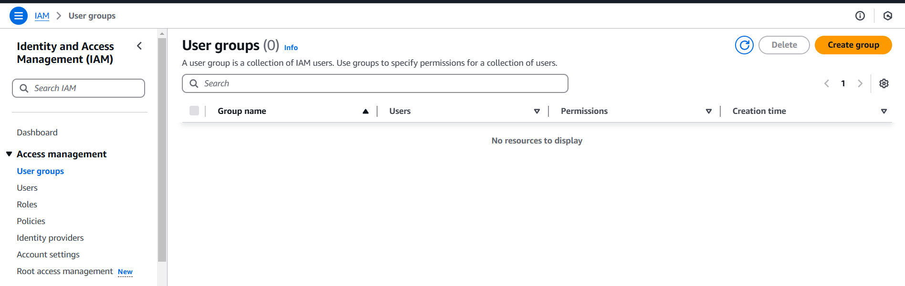
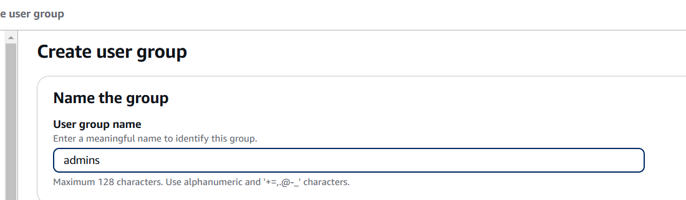
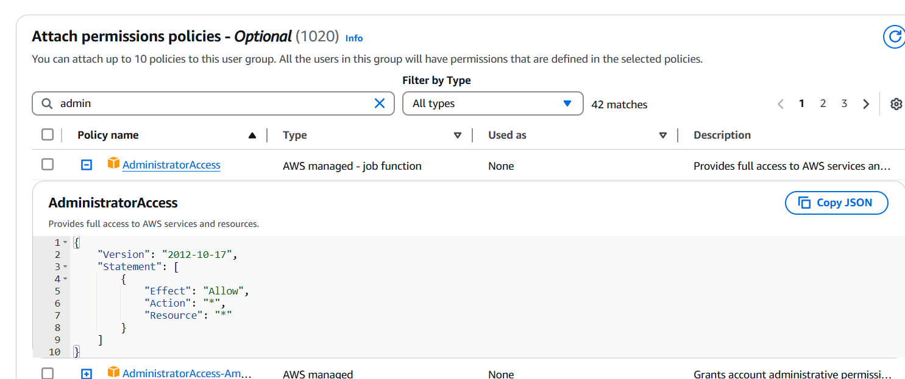
CreateUsergroup button
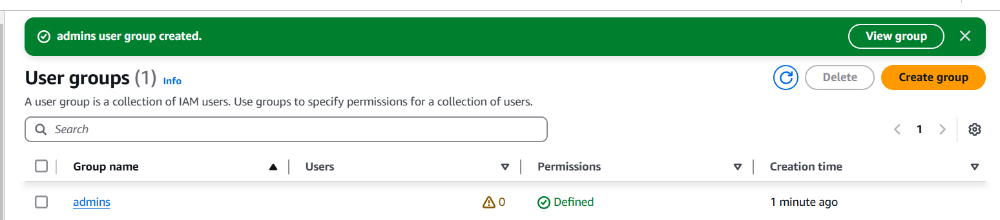

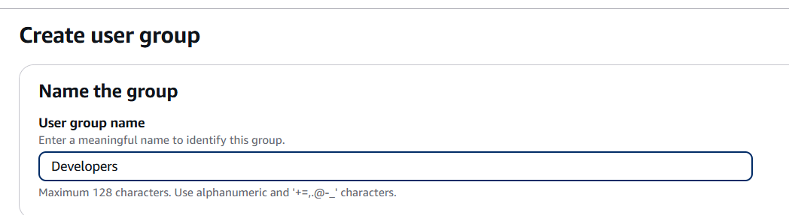
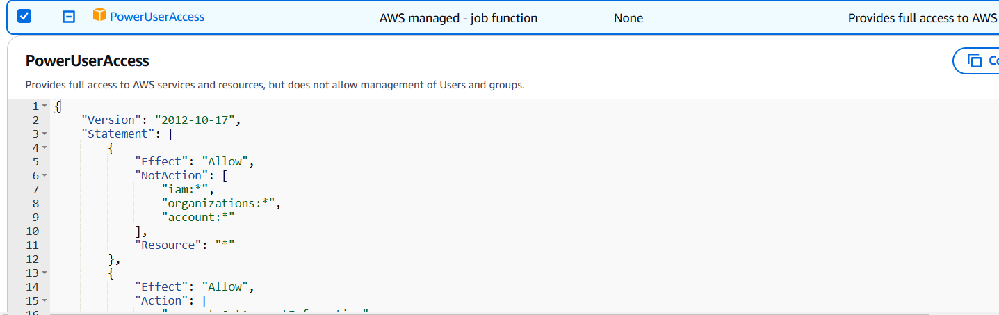

create tester group
have assign any policy


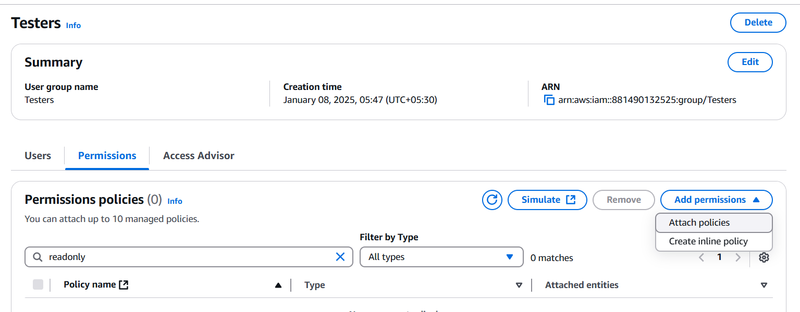
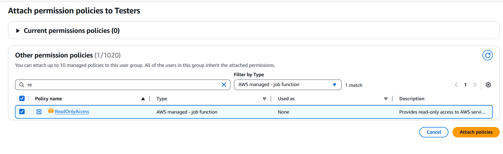
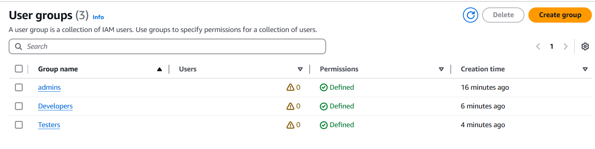

Add user
 create user
 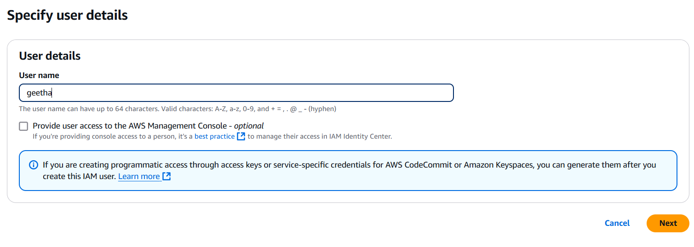
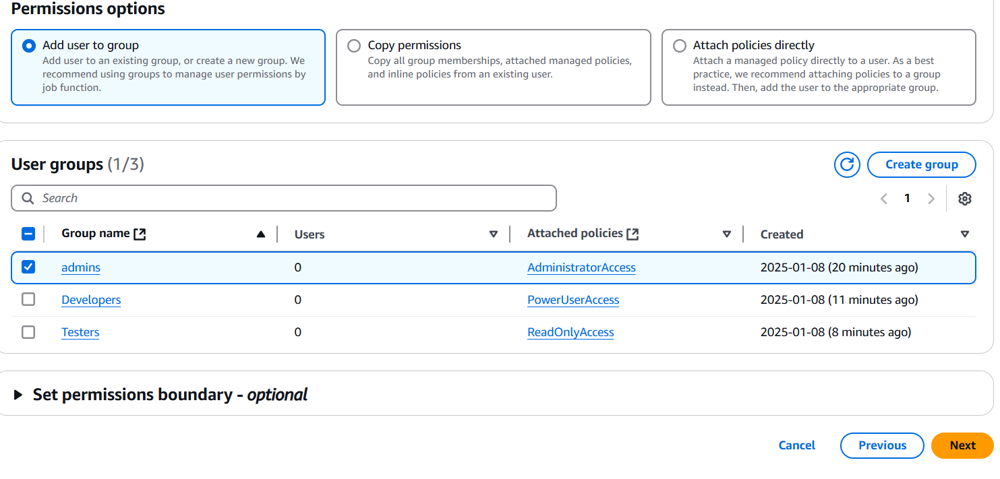


# can i assign one user to multiple groups in AWS console

Yes, in AWS IAM (Identity and Access Management), you can assign one user to multiple groups. This allows flexibility in organizing and managing permissions for users based on their roles and responsibilities.
# Advantages of Assigning a User to Multiple Groups:
## Granular Access Control:

By assigning a user to multiple groups, you can combine different sets of permissions from different groups to match the specific needs of the user.
For example, a user can be in a Developer group (providing access to EC2, S3, Lambda) and a Database group (providing access to RDS) if they need to work on both services.
# Simplified Permission Management:

You can create policies that grant different levels of access to specific services or actions. Grouping users into different categories (e.g., developers, admins, finance) allows easier permission assignment and maintenance.
If the user's responsibilities grow over time, you can simply add them to more groups without having to modify the user’s permissions directly.
Scalability:

Assigning users to multiple groups helps when managing large numbers of users with overlapping roles. This is more scalable than creating custom policies for each individual user.
Separation of Duties:

By assigning users to different groups, you can implement the principle of separation of duties. For example, an IAM user may be in both a read-only group and a developer group, allowing the user to read data but not modify it unless in the developer group.
# Disadvantages of Assigning a User to Multiple Groups:
## Complexity in Permission Management:

If multiple groups are attached to the same user, the user will have the union of permissions from all groups. This could potentially lead to permission conflicts (e.g., one group allows access to a resource while another restricts it).
Overlapping permissions can become complex to track and audit, especially in larger environments.
# Risk of Over-permissioning:

If a user is assigned to too many groups, they might accumulate permissions that they don’t need or shouldn’t have. This can lead to unintended security risks.
Managing permissions effectively requires careful planning to avoid accidental exposure of sensitive resources.
# Troubleshooting Issues:

If a user has issues with their permissions, figuring out which group is causing the problem can be more difficult if the user belongs to multiple groups.
It requires a careful review of the combined permissions from all the groups to understand why a specific permission is granted or denied.


Add nother user as john 
assugn 2 groups (developer and tester)

goto users

select john or any user
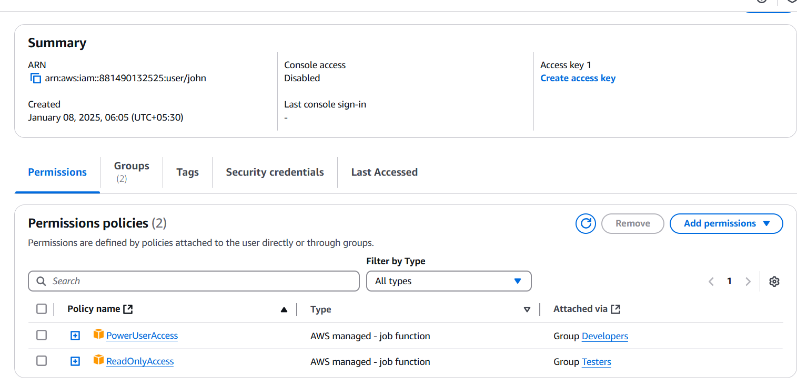

# What is the use of Create access key?
The "Create access key" feature in AWS IAM (Identity and Access Management) is used to generate access credentials for an IAM user, which can then be used for programmatic access to AWS services.

# What is an Access Key?
An access key consists of two parts:

**Access Key ID:** A unique identifier for the access key.
**Secret Access Key:** A secret key used to sign requests made to AWS APIs (must be kept confidential).
These keys allow the IAM user to authenticate API calls and interact programmatically with AWS resources using the AWS CLI (Command Line Interface), SDKs (Software Development Kits), or direct API calls.

# When to Use Access Keys:
You typically create access keys for users who need to:

**Perform Automated Tasks:** Automate AWS tasks using scripts or tools like AWS CLI or SDKs (e.g., uploading data to S3, provisioning EC2 instances, etc.).
**Integrate AWS with Applications:** Allow applications or services to interact with AWS resources programmatically (e.g., a web server accessing a DynamoDB database).
**Interact with AWS APIs:** When building or using tools that directly communicate with AWS APIs, such as using SDKs in different programming languages (Python, Java, Node.js, etc.).
# How to Create Access Keys for an IAM User:
Log in to the AWS Management Console:

Navigate to the IAM Console.
Go to IAM Users:

In the left sidebar, click on Users under the Access management section.
Select the User:

Choose the user for whom you want to create access keys.
**Create** Access Key:

In the Security Credentials tab of the user’s page, scroll down to the Access keys (access key ID and secret access key) section.
Click the Create access key button.
**Download or Copy the Keys:**

After creating the access key, AWS will display the Access Key ID and Secret Access Key.
**Important:** You can only view the Secret Access Key once at the time of creation. Be sure to copy or download it and store it securely.
Use Cases for Access Keys:
**Automating Tasks:**

You can use the AWS CLI or scripts to automate AWS operations like provisioning resources or managing S3 buckets.
Example (using AWS CLI):

`aws s3 cp myfile.txt s3://mybucket/ --profile myuser`
## Programmatic Access with SDKs:

If you're developing an application that needs to interact with AWS, you'll use one of the AWS SDKs. The SDKs allow you to easily make API calls using the access key.
## Example (Python with Boto3 SDK):

`import boto3`
`s3 = boto3.client('s3', aws_access_key_id='ACCESS_KEY_ID', aws_secret_access_key='SECRET_ACCESS_KEY')`
`s3.upload_file('myfile.txt', 'mybucket', 'myfile.txt')`
Third-party Tools:

Some third-party tools and services require AWS access keys to interact with your AWS environment (e.g., monitoring tools or CI/CD pipelines).
Advantages of Access Keys:
Programmatic Access:

Provides a way for applications, scripts, and services to interact with AWS without needing to log into the AWS Management Console.
Automation:

Enables automation of workflows, deployments, and other tasks that would be tedious to do manually via the console.
# Secure Authentication:

Access keys are used in conjunction with AWS services' authentication mechanisms to ensure that only authorized users and applications can access resources.
#Security Considerations:
**Secret Access Key:** Always protect the secret access key. If it's compromised, anyone who has it can make requests to AWS on your behalf, potentially incurring charges or damaging resources.
Rotate Access Keys Regularly: For security, it's a good practice to rotate access keys periodically. This involves deleting old keys and creating new ones.
**Use IAM Roles:** If possible, use IAM roles (especially for EC2 instances, Lambda, or other AWS services) instead of access keys. IAM roles are more secure and easier to manage, as they don’t require embedding access keys in code or storing them in configuration files.
Use MFA (Multi-Factor Authentication): While MFA doesn’t apply directly to access keys, enabling MFA for the IAM user ensures that their console access is more secure.
# How to Remove or Deactivate Access Keys:
Log in to the AWS Management Console:

Go to the IAM Console.
Go to IAM Users:

In the left sidebar, click on Users.
Select the User:

Choose the IAM user whose access key you want to remove.
Remove the Access Key:

Go to the Security Credentials tab.
Under Access keys (access key ID and secret access key), you’ll see a list of the user’s access keys.
To deactivate, click the Make inactive button.
To delete, click the Delete button to permanently remove the key.
# Summary:
Access Keys provide programmatic access to AWS services and resources, enabling users or applications to interact with AWS via API calls, the AWS CLI, or SDKs.
They are typically used for automation, integration with applications, or when interacting with AWS programmatically.
Security is critical when managing access keys, so always store them securely and rotate them regularly. For higher security, consider using IAM roles for AWS services instead of access keys when possible.

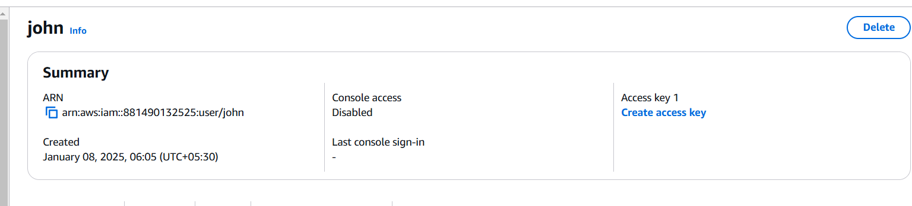
# what is arn in aws?
In AWS (Amazon Web Services), ARN stands for Amazon Resource Name. It is a unique identifier used to specify AWS resources in a standardized format across services. ARNs are essential for defining permissions in AWS IAM (Identity and Access Management) policies, among other use cases.

# What is an ARN?
An ARN is a globally unique identifier for AWS resources. It provides the complete path to a resource within AWS and is used in AWS policies, logging, and auditing to refer to resources.

## ARN Structure:
The general format of an ARN is:


`arn:aws:service:region:account-id:resource-type/resource-id`
Where:

**arn:** This is the literal prefix that identifies the string as an ARN.
**aws:** Identifies the partition of AWS (for example, aws for standard AWS regions, or aws-us-gov for AWS GovCloud).
**service:** The AWS service (e.g., iam, s3, ec2, etc.).
**region:** The AWS region (e.g., us-east-1, us-west-2, etc.), but some resources (like IAM) are global and don’t require a region.
**account-id:** Your AWS account ID (a 12-digit number).
**resource-type/resource-id:** The specific resource and its identifier (e.g., user/JohnDoe, bucket/my-bucket-name, instance/i-1234567890abcdef).
## IAM User ARN Example:
For an IAM user named Alice in an AWS account with the ID 123456789012, the ARN would look like this:


`arn:aws:iam::123456789012:user/Alice`
**arn:** The identifier prefix for ARN.
**aws**: AWS partition.
**iam:** The service name (in this case, IAM).
**123456789012:** The AWS account ID.
**user/Alice:** The resource type (user) and the specific resource (Alice).
Other Examples of ARNs:
**S3 Bucket ARN:** If you have an S3 bucket named my-bucket, its ARN would be:


`arn:aws:s3:::my-bucket`
EC2 Instance ARN: For an EC2 instance with ID i-1234567890abcdef, the ARN would be:

`arn:aws:ec2:us-west-2:123456789012:instance/i-1234567890abcdef`
Lambda Function ARN: For a Lambda function named myLambdaFunction, the ARN would be:


`arn:aws:lambda:us-east-1:123456789012:function:myLambdaFunction`
# Why is ARN Important?
IAM Policies: ARNs are commonly used in IAM policies to define permissions. For example, a policy might grant access to a specific S3 bucket or EC2 instance using the ARN of that resource.

## Example IAM policy allowing access to a specific S3 bucket:

```json
{
    "Version": "2012-10-17",
    "Statement": [
        {
            "Effect": "Allow",
            "Action": "s3:ListBucket",
            "Resource": "arn:aws:s3:::my-bucket"
        }
    ]
}
```
**Resource References:** ARNs are used to refer to specific resources in AWS APIs, logs, or notifications. For instance, when triggering events in services like Lambda or SNS, ARNs uniquely identify the target resource.

**Resource-Level Permissions:** When defining permissions, you can use ARNs to apply policies to specific resources. For example, a policy can grant permissions only to a specific IAM user or EC2 instance, ensuring more granular access control.

# In Summary:
ARN (Amazon Resource Name) is a unique identifier for AWS resources.
IAM User ARN is used to uniquely identify IAM users.
ARNs are essential in IAM policies to control access and specify actions on specific resources.
The general ARN structure includes service, region, account ID, and resource-specific identifiers.

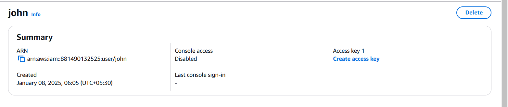
create access key
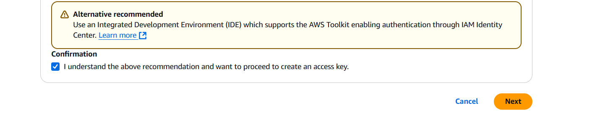
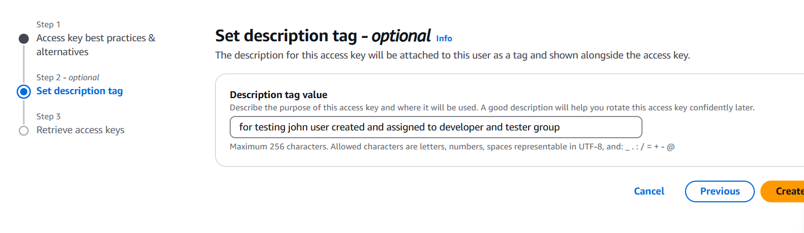
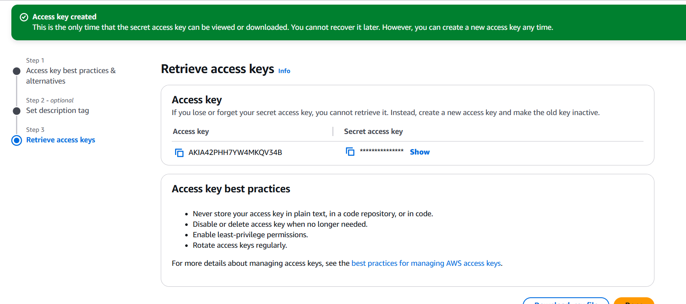

show will be visible only inside h=the page once you left from the page access key will not be visibile

so download and keep it safe
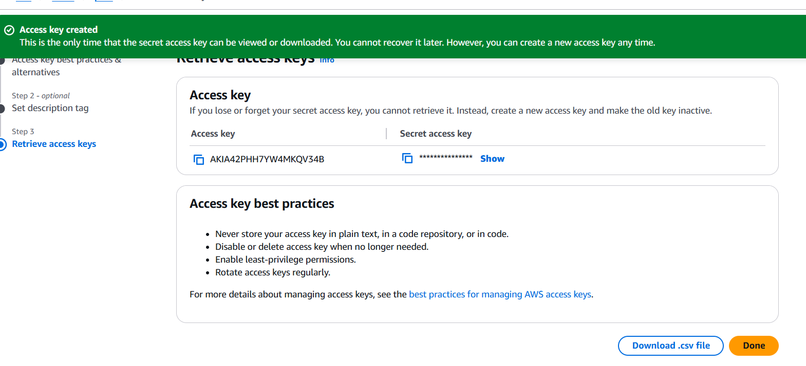


IAM Creation
If you want to create IAM user 
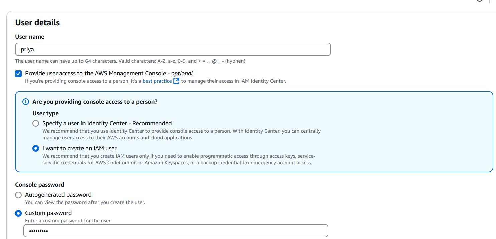
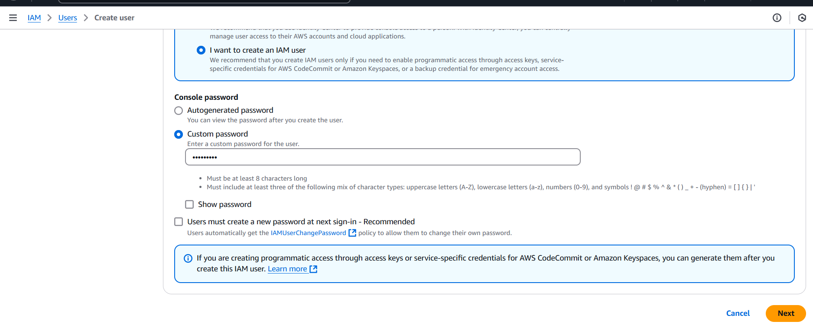
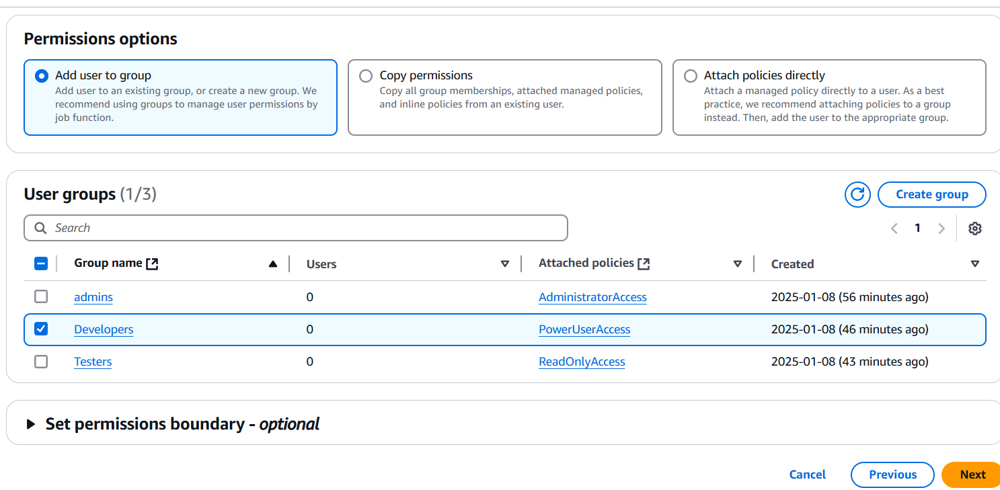
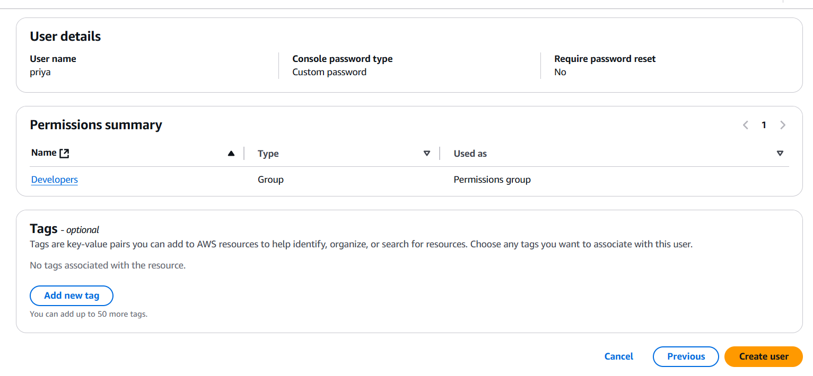
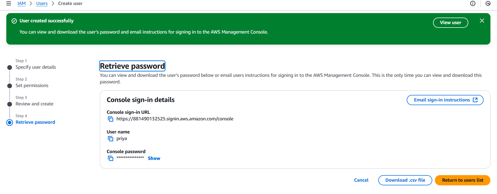

download csv file

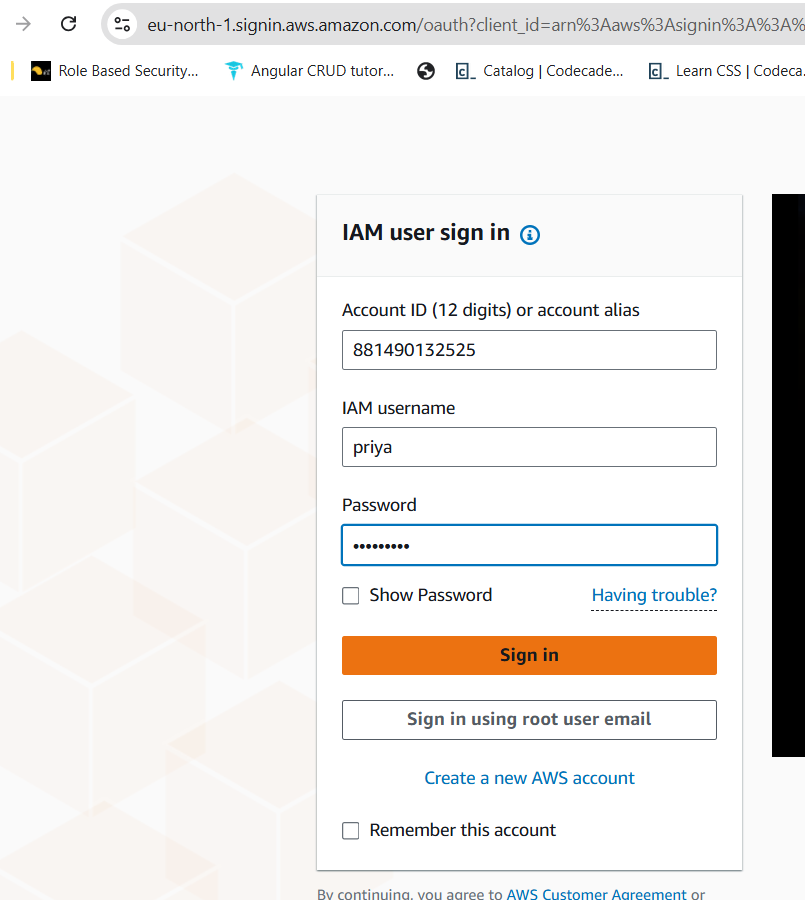


# Delete Group

if you delete all the group.
under user group will be removed automatically
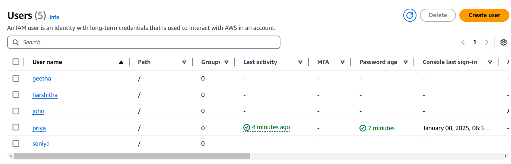

